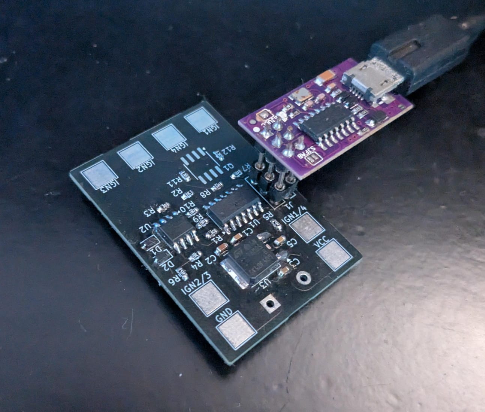

# Dwell shaping board for Mazda Miata

This board lets you use a toyota/audi/etc "coil on plug" ignition system with the stock ecu in a Mazda Miata (1989-2005).

The board will take in a variable dwell signal for the stock coilpack and output a (falling edge synchronised) stable, adjustable dwell pulse.

Current setting is 70 "ticks" of TIMER1, around 2.2ms, correct for toyota cop's at running voltages (accounting for voltage drop in car wiring).

Written in C for an AtTiny84A, for speed

